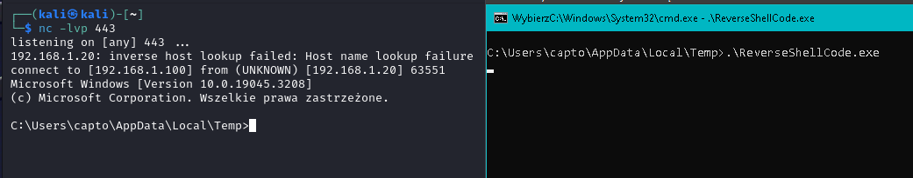

## Opisy folderów:

### Folder `examples`:
Zawiera kody źródłowe w języku C# (wersja 5.0, język C# 9.0), które są tworzone i automatycznie kompilowane przez skrypty PowerShell za pomocą Add-Type. Są to jedynie przykłady nie trzeba ich pobierać ani kompilować.

### Folder `noReboot`:
Autorem kodu źródłowego jest Grzegorz Tworek [link](https://github.com/gtworek/PSBits/tree/master/NoRebootSvc).

Folder zawiera zmodyfikowany kod z komentarzami oraz plik .vcxproj z konfiguracją projektu Visual Studio, który umożliwia skompilowanie tego przykładu.

### Folder `svc`:
Zawiera przykłady użycia programu "svc" z repozytorium Grzegorza Tworka [link](https://github.com/gtworek/PSBits/blob/master/Services/sekurak/svc.c). Do kompilacji tego kodu można wykorzystać konfigurację projektu [psSession0](https://github.com/IsJackAlive/CaptoWindows/blob/main/psSession0/dll-example.vcxproj).

Wykonanie pliku info.txt zapisuje do informacje.txt wersję systemu, informacje o dostępie do internetu (ping), otwartych portach (netstat -an), wylistowanie wszystkich wpisów w Boot Configuration Data(BCD) poleceniem (bcdedit /enum all) oraz wiadomościach z wykoania polecenia (diskpart /S c:\source\dp-script.txt).

- [dp-script.txt](https://github.com/IsJackAlive/CaptoWindows/blob/main/attachments/svc/dp-script.txt) skrypt Diskpart, 
- [info.txt](https://github.com/IsJackAlive/CaptoWindows/blob/main/attachments/svc/info.txt) należy zapisać tak jak ustalono w `FILENAME` w kodzie kompilowanej biblioteki 
- [informacje.txt](https://github.com/IsJackAlive/CaptoWindows/blob/main/attachments/svc/informacje.txt) plik wyjściowy dla malware.txt. 

## Opisy plików:

### CaptoServices.txt
Plik tworzony na pulpicie przez skrypty PowerShell dostępne w repozytorium. Zawiera datę oraz lokalizację pliku .exe dla utworzonej usługi systemowej.

### checkDNet.ps1
Może być używany do wstępnej diagnostyki, jeżeli PowerShell nie może utworzyć usług z repozytorium.

Skrypt wyświetla wersję PowerShell, pokazuje najstarszą i najnowszą wersje .NET Framework. Sprawdza dostępność biblioteki System.Diagnostics, która jest wykorzystywane przy kompilacji usług systemowych.

### clearCapto.ps1
Wyłącza wymienione usługi: "CantStop", "CertService", "RunService", "CaptoPs", "norebootsvc". Z parametrem -d usuwa te usługi, np. `.\clearCapto.ps1 -d`

### Hello.ps1 i HelloVB.ps1
Przykłady kompilacji programu .exe korzystając z Add-Type w PowerShell. `Hello.ps1` zawiera kod w języku C#, a `HelloVB.ps1` zawiera kod w Visual Basic .NET.

### tcpReverse.ps1
Skrypt kompiluje prosty reverse shell w języku C#, zainspirowany artykułem: [C# Simple Reverse Shell](https://www.puckiestyle.nl/c-simple-reverse-shell/).
* Ustaw zmienne `$serverIP` i `$serverPort` na odpowiednie wartości.
* Skrypt generuje kod C# i kompiluje go do pliku wykonywalnego (.exe)

