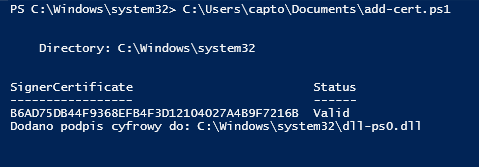

# Dokumentacja skryptu CertService.ps1

## Wprowadzenie

Skrypt CertService.ps1 służy do tworzenia i uruchamiania prostego serwisu systemowego w systemie Windows. Ten serwis jest napisany w języku C# i kompilowany do pliku wykonywalnego (.exe) w trakcie działania skryptu. Skrypt ten wykonuje następujące czynności:

<details open>
  <summary>Skrypt wykonuje następujące czynności:</summary>

1. **Tworzenie certyfikatu "pscertservice"**
   - Generuje certyfikat o nazwie "pscertservice".
   - Jeśli certyfikat nie zostanie utworzony, skrypt wyświetli odpowiedni komunikat.

2. **Eksport certyfikatu do pliku PFX**
   - Skrypt eksportuje utworzony certyfikat do pliku PFX.
   - Certyfikat jest zabezpieczony hasłem 'Test123#'.

3. **(OPCJONALNIE) Przeniesienie certyfikatu do zaufanych certyfikatów administratora**
   - Certyfikat "pscertservice" jest przenoszony do magazynu certyfikatów zaufanych certyfikatów administratora (w cmd: `certlm` następnie `Zaufane główne urzędy certyfikacji\Certyfikaty`).

4. **Tworzenie usługi CertService**
   - Skrypt definiuje parametry serwisu, takie jak jego nazwę, wyświetlaną nazwę i opis.
   - Kod źródłowy serwisu napisany w języku C# jest zawarty w zmiennej `$serviceCode`.

5. **Zapisywanie kodu C# do pliku**
   - Kod źródłowy serwisu jest zapisywany do pliku o nazwie "CertService.cs" w folderze tymczasowym systemu.

6. **Kompilowanie kodu C# do pliku wykonywalnego .exe**
   - Skrypt kompiluje kod źródłowy C# do pliku wykonywalnego (.exe) o nazwie "CertService.exe".
   - Dodawane są niezbędne odwołania do bibliotek.

7. **Sprawdzenie, czy plik .exe ma certyfikat**
   - Skrypt sprawdza, czy plik .exe, który zawiera serwis, jest podpisany certyfikatem.

8. **Dodawanie serwisu do Serwisów Windows**
   - Po pomyślnym sprawdzeniu podpisu pliku .exe, skrypt tworzy serwis w systemie Windows, który wykorzystuje ten plik jako binarny.

9. **Sprawdzanie stanu serwisu**
    - Na zakończenie, skrypt sprawdza stan utworzonego serwisu i wyświetla informacje na jego temat.

</details>

<details open>
  <summary>Opis działania serwisu</summary>
    Serwis zawiera timer, który co 10 sekund sprawdza, czy uruchomiony jest proces o nazwie "CalculatorApp", czyli domyślna aplikacja kalkulatora w systemach Windows. Jeśli proces ten jest uruchomiony, serwis zapisuje odpowiednią informację w dzienniku zdarzeń systemu (Event Log).
</details>

## Aby uruchomić serwis
W PowerShell wpisz:

```powershell
sc.exe start CertService
```

## Uwagi

Przed uruchomieniem skryptu upewnij się, że masz odpowiednie uprawnienia administratora.

To jest dokumentacja dla skryptu "CertService.ps1", która opisuje kroki do utworzenia i uruchomienia serwisu systemowego w systemie Windows za pomocą języka C# i PowerShell.

Skrypt można dostosować do własnych potrzeb i użyć go jako przykładu do tworzenia własnych serwisów systemowych.

Jeśli wystąpią błędy podczas wykonywania skryptu, serwis można usunąć za pomocą:

```powershell
sc.exe delete CertService
```

Utworzony certyfikat:

cmd: `certlm` -> `Zaufane główne urzędy certyfikacji\Certyfikaty` <br>
folder: `c:\temp\`

# Skrypt AddCert.ps1

Skrypt wykorzystuje utworzony przez CertService podpis cyfrowy, do podpisania biblioteki `dll-ps0.dll` (psSession0).

Przed uruchomieniem skryptu, upewnij się, że ścieżka do pliku DLL została poprawnie skonfigurowana w zmiennej `$dllPath`.



<details open>
  <summary>Opis działania skryptu</summary>

1. **Pobranie certyfikatu**

    Skrypt rozpoczyna od pobrania certyfikatu o nazwie "pscertservice" z lokalnego magazynu certyfikatów (Cert:\LocalMachine\Root).

2. **Sprawdzenie istniejącego podpisu**

    Sprawdza, czy plik DLL już posiada podpis cyfrowy. Jeśli plik nie ma podpisu lub ma status 'NotSigned', skrypt przechodzi do kolejnego kroku.

3. **Dodanie podpisu cyfrowego**

    Jeśli plik nie posiada podpisu, skrypt dodaje podpis cyfrowy do pliku DLL, używając wcześniej pobranego certyfikatu "pscertservice". Po dodaniu podpisu, wyświetla komunikat informujący o udanej operacji.

4. **Komunikat o istniejącym podpisie**

    Jeśli plik już posiada podpis cyfrowy, skrypt informuje użytkownika, że podpis istnieje.
</details>

## Uwagi

W przypadku, gdy użytkownik chce usunąć podpis cyfrowy z biblioteki lub innego pliku, może skorzystać z narzędzia dostępnego pod następującym linkiem: 
<a href="https://github.com/IsJackAlive/CaptoWindows/tree/main/deleteCert">DeleteCert</a>.
Program umożliwia usuwanie podpisu cyfrowego bez konieczności korzystania z signtool, które jest dostępne w Windows 8 SDK.