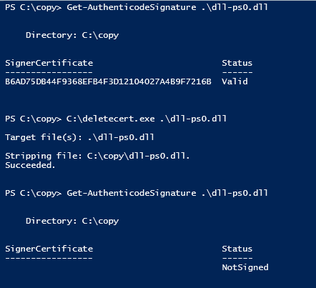

# deleteCert project documentation

## Introdution

**Make unsignable files signable again.**

The tool provides a simple way to remove a digital signature. Allows to remove certificates, without using `signtool` available since Windows 8 SDK.

> The source code of the deleteCert(delcert) tool is publicly available on the XDA forum. I have decided to make improvement and share the updated version on my GitHub account.

Authors:
- 8/10/2006 - Drew
- 7/19/2008 - deepred
- <a href="https://xdaforums.com/t/delcert-sign-strip-tool.416175/#post-2508061">Link to XDA post</a>

## Description
Tool that strips (removes) the digital signature (Authenticode) from PE executable files like `*.exe, *.dll, *.mui, etc.` On error, an HRESULT is returned (e.g., 0x00000005 means that the file is read-only).

The compiled exe file size is  122 KB / 124 928 B.

## Usage Example
```plaintext
deletecert.exe C:\test\dll-gt-svc.dll
deletecert.exe C:\test\dll-ps0.dll
```


## Changes Made
The following change has been made to use the safer wcsncpy_s function:

```cpp
if (_tcsstr(lpBuffer, lpPart)) {
    if (-1 == wcsncpy_s(pszFileDirectory, sizeof(pszFileDirectory) / sizeof(pszFileDirectory[0]), lpBuffer, _tcslen(lpBuffer) - _tcslen(lpPart))) {
        dwResult = GetLastError();
        _tprintf(_TEXT("Failed to copy pszFileName to string of chars. GLE == x0%08x\n"), dwResult);
        goto exit;
    }
}
```

## Note
This code is provided as an example and can be used to remove `pscertservice` from examples after conducting tests.

# Format of a Signed File

> Source: authenticode.txt file located in the project

A signed file is a standard Windows PE executable with signature data appended
to it.  A PE file begins with a 16-bit MSDOS executable stub (which just prints
a message that you can't run the program and exits).  Following this is the
real data, organised in a COFF-like format.  The general COFF header which is
always present is followed by another header which contains information on
executables (it's referred to as an optional header, but it's always present
for executables).  This header defines a number of data directories which
contain data sections within the executable.  One of these directory entries is
an (undocumented) IMAGE_DIRECTORY_ENTRY_SECURITY, which is used to store the
signature: Hash the entire file, add a security directory entry large enough to
contain the signature, and write the signature at that position in the file.

The signing process is as follows:

1. Hash the file, skipping the file checksum (another undocumented attribute,
   but there are standard Windows functions to calculate it) and the
   IMAGE_DIRECTORY_ENTRY_SECURITY entry.
2. Generate the signature and append it to the file.
3. Write the signature position and size (padded out to a multiple of 16 bytes)
   into the IMAGE_DIRECTORY_ENTRY_SECURITY.  The signature position is the end
   of the file, since it's simply appended to the existing data.
4. Update the file checksum.

The security information begins with a 32-bit length (which is ignored) and a
32-bit flags field which should be set to 0x00020200.  Most of the flags are
unused, although changing the first 0x02 to a 1 gives an invalid signature, and
changing the second one to anything other than 0x02 results in the signature
check silently failing with no error message or other indication.

Immediately following this is a complex PKCS #7 signature record which contains
a detached signature for the rest of the file.  The outer wrapper is PKCS #7
signedData, with the signed content being an spcIndirectDataContext (an MS-
defined data type) which contains an (obsolete) spcPelmageData record and an
MD5 hash of the file.  The exact format is:

```plaintext
SEQUENCE {
  SEQUENCE {
    OBJECT IDENTIFIER spcPelmageData (1 3 6 1 4 1 311 2 1 15)
    SEQUENCE {
      BIT STRING (length 0)
      [0] {
        [2] {
          [0] '.<.<.<.O.b.s.o.l.e.t.e.>.>.>'
          }
        }
      }
    }
  SEQUENCE {
    SEQUENCE {
      OBJECT IDENTIFIER md5 (1 2 840 113549 2 5)
      NULL
      }
    OCTET STRING
      xx xx xx xx xx xx xx xx xx xx xx xx xx xx xx xx
    }
  }
}
```

where the x's are the MD5 hash of the file and the content-type for the whole
is spcIndirectDataContext (1 3 6 1 4 1 311 2 1 4).  You can use a toolkit such
as cryptlib to generate this type of data, as well as creating the special
AuthentiCode certs you need for the signing.

The signed content is followed by the standard PKCS #7 signedData fields, first
a certificate chain containing a complete chain of certs from a known CA to an
end-users AuthentiCode signing certificate and then information on the signer
(that is, data to identify the AuthentiCode certificate which signed the whole
thing), an identifier for the hash algorithm used (again, MD5), and some
authenticated attributes.  These contain more MS-defined attributes, typically
spcSpOpusInfo and spcStatementType which are used to provide information on the
signer (eg whether they're using an individual or commercial signing
certificate).  Also included is a messageDigest attribute which contains the
MD5 hash of the spcIndirectDataContext content of the signedData.  Finally, the
authenticated attributes are hashed and signed, with the signature being
included at the end of the collection of signature information (this is the
standard PKCS #7 signature process).  Again, this is standard stuff which you
can create using cryptlib.

To create the signature, you need to hash the entire file (skipping the
checksum and IMAGE_DIRECTORY_ENTRY_SECURITY as explained above) and write the
hash into the spcIndirectDataContext content record.  Then hash this and write
the hash and other attributes into the authenticated attributes.  Finally, hash
the authenticated attributes and append the signature to the end of the
signature record.  This means that each collection of data is covered by its
own hash, which is then passed up the chain to the next level until it reaches
the signature.  If you're using an existing crypto toolkit to do this, create a
PKCS #7 signedData item, set the content-type to spcIndirectDataContext, drop
in the spcIndirectDataContext content itself, and sign it, the rest will be
handled by the PKCS #7 signing code.