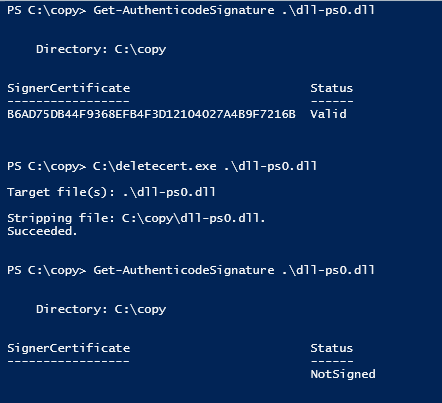

# Dokumentacja projektu deleteCert

[](https://github.com/IsJackAlive/CaptoWindows/tree/main/deleteCert/README.en.md)

## Wprowadzenie

**Przywraca możliwość cyfrowego podpisania pliku.**

Narzędzie stanowi prosty sposób na usunięcie cyfrowego podpisu. Pozwala na usuwanie certyfikatów, bez korzystania z `signtool` dostępnego od Windows 8 SDK.

> Kod źródłowy narzędzia deleteCert(delcert) jest dostępny publicznie na forum XDA. Postanowiłem wprowadzić poprawkę i udostępnić zaktualizowaną wersję na moim koncie GitHub.

Autorzy:
- 8/10/2006 - Drew
- 7/19/2008 - deepred
- <a href="https://xdaforums.com/t/delcert-sign-strip-tool.416175/#post-2508061">Link do postu XDA</a>

## Opis
Program usuwa (odłącza) cyfrowy podpis (Authenticode) z plików wykonywalnych PE, takich jak `*.exe, *.dll, *.mui itp.` W przypadku błędu zwracany jest HRESULT (np. 0x00000005 oznacza, że plik jest tylko do odczytu).

Rozmiar pliku exe(po kompilacji) wynosi 122 KB / 124 928 B.

## Przykład użycia
```plaintext
deletecert.exe C:\test\dll-gt-svc.dll
deletecert.exe C:\test\dll-ps0.dll
```



## Wprowadzone Zmiany
Dokonałem następującej zmiany, aby używać bezpieczniejszej funkcji wcsncpy_s:

```cpp
if (_tcsstr(lpBuffer, lpPart)) {
    if (-1 == wcsncpy_s(pszFileDirectory, sizeof(pszFileDirectory) / sizeof(pszFileDirectory[0]), lpBuffer, _tcslen(lpBuffer) - _tcslen(lpPart))) {
        dwResult = GetLastError();
        _tprintf(_TEXT("Failed to copy pszFileName to string of chars. GLE == x0%08x\n"), dwResult);
        goto exit;
    }
}
```

## Uwaga
Ten kod jest dostarczony jako przykład i może być używany do usunięcia dodanego certyfikatu `pscertservice` po przeprowadzeniu testów.

# Struktura Podpisanego Pliku

> Źródło: przetłumaczony plik authenticode.txt znajdujący sie w projekcie

Plik podpisany to standardowy plik wykonywalny Windows PE, do którego dołączono dane podpisu. Plik PE zaczyna się od 16-bitowego fragmentu MSDOSowego (który tylko wyświetla komunikat, że nie można uruchomić programu, i kończy działanie). Następnie znajdują się rzeczywiste dane, zorganizowane w formacie podobnym do COFF. Ogólny nagłówek COFF, który zawsze istnieje, jest następnie poprzedzony innym nagłówkiem zawierającym informacje o plikach wykonywalnych (nazywany nagłówkiem opcjonalnym, ale zawsze obecny w plikach wykonywalnych). Ten nagłówek definiuje wiele katalogów danych, które zawierają sekcje danych w pliku wykonywalnym. Jednym z tych wpisów katalogowych jest (nieudokumentowany) IMAGE_DIRECTORY_ENTRY_SECURITY, który służy do przechowywania podpisu: suma kontrolna całego pliku, dodanie wpisu do katalogu bezpieczeństwa o odpowiedniej wielkości i zapisanie podpisu na tej pozycji w pliku.

Proces podpisywania przebiega następująco:

1. Zahaszuj plik, pomijając sumę kontrolną pliku (kolejny nieudokumentowany atrybut, ale istnieją standardowe funkcje systemu Windows do jej obliczania) oraz wpis IMAGE_DIRECTORY_ENTRY_SECURITY.
2. Wygeneruj podpis i dołącz go do pliku.
3. Zapisz pozycję i rozmiar podpisu (uzupełniony do wielokrotności 16 bajtów) w IMAGE_DIRECTORY_ENTRY_SECURITY. Pozycja podpisu to koniec pliku, ponieważ jest on po prostu dołączany do istniejących danych.
4. Zaktualizuj sumę kontrolną pliku.

Informacje bezpieczeństwa zaczynają się od 32-bitowej długości (która jest ignorowana) i pola 32-bitowych flag, które powinno być ustawione na 0x00020200. Większość flag jest nieużywana, choć zmiana pierwszego 0x02 na 1 daje nieważny podpis, a zmiana drugiego na cokolwiek innego niż 0x02 skutkuje niepowodzeniem sprawdzania podpisu bez żadnego komunikatu o błędzie.

Bezpośrednio po tym znajduje się złożony rekord podpisu PKCS #7, który zawiera odczepiony podpis dla reszty pliku. Zewnętrzna powłoka to PKCS #7 signedData, a podpisana zawartość to spcIndirectDataContext (typ danych zdefiniowany przez MS), który zawiera rekord spcPelmageData (przestarzały) i skrót MD5 pliku. Dokładny format to:

```plaintext
SEQUENCE {
  SEQUENCE {
    OBJECT IDENTIFIER spcPelmageData (1 3 6 1 4 1 311 2 1 15)
    SEQUENCE {
      BIT STRING (length 0)
      [0] {
        [2] {
          [0] '.<.<.<.O.b.s.o.l.e.t.e.>.>.>'
          }
        }
      }
    }
  SEQUENCE {
    SEQUENCE {
      OBJECT IDENTIFIER md5 (1 2 840 113549 2 5)
      NULL
      }
    OCTET STRING
      xx xx xx xx xx xx xx xx xx xx xx xx xx xx xx xx
    }
  }
}
```

gdzie x-y to skrót MD5 pliku, a typ treści dla całego to spcIndirectDataContext (1 3 6 1 4 1 311 2 1 4). Możesz użyć narzędzi takich jak cryptlib do generowania tego rodzaju danych, a także do tworzenia specjalnych certyfikatów AuthentiCode, które są potrzebne do podpisywania.

Podpisana zawartość jest następnie poprzedzona standardowymi polami PKCS #7 signedData, najpierw łańcuchem certyfikatów zawierającym pełny łańcuch certyfikatów od znanego urzędu certyfikacyjnego do certyfikatu AuthentiCode użytkownika końcowego, a następnie informacją o podpisującym (to znaczy danymi identyfikującymi certyfikat AuthentiCode, który podpisał całość), identyfikatorem używanego algorytmu skrótu (ponownie MD5) i kilkoma uwierzytelnionymi atrybutami. Zawierają one więcej atrybutów zdefiniowanych przez MS, zazwyczaj spcSpOpusInfo i spcStatementType, które służą do dostarczania informacji o podpisującym (np. czy używa certyfikatu podpisującego indywidualnego czy komercyjnego). Zawarty jest również atrybut messageDigest, który zawiera skrót MD5 treści spcIndirectDataContext w signedData. Na koniec uwierzytelnione atrybuty są haszowane i podpisywane, a podpis jest dołączany na koniec zbioru informacji o podpisie (to jest standardowy proces podpisywania PKCS #7). Ponownie, to są standardowe rzeczy, które można utworzyć za pomocą cryptlib.

Aby utworzyć podpis, musisz zahaszować cały plik (pomijając sumę kontrolną i IMAGE_DIRECTORY_ENTRY_SECURITY, jak wyjaśniono powyżej) i zapisać sumę kontrolną w rekordzie zawartości spcIndirectDataContext. Ponownie zahaszuj i zapisz sumę kontrolną i inne atrybuty w uwierzytelnionych atrybutach. Na koniec zahaszuj uwierzytelnione atrybuty i dołącz podpis na koniec rekordu podpisu. Oznacza to, że każda kolekcja danych jest pokrywana własnym haszem, który jest następnie przekazywany w górę łańcucha do kolejnego poziomu, aż otrzyma podpis. Jeśli używasz narzędzia kryptograficznego do tego celu, utwórz element PKCS #7 signedData, ustaw typ treści na spcIndirectDataContext, umieść w nim samą treść spcIndirectDataContext i podpisz ją, resztą zajmie się kod PKCS #7 do podpisywania.