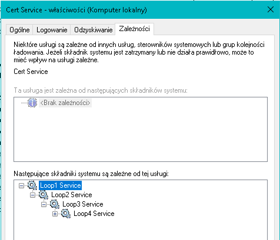

# Dokumentacja skryptów LoopService

## Wprowadzenie

Zestaw skryptów LoopService służy do tworzenia i uruchamiania prostych serwisów systemowych, analogicznie do przykładów RunService, CertService, cantStop. Skrypty automatycznie tworzą zależności.

Należy wykonywać je od Loop1Service do Loop4Service (zgodnie z kolejnością w nazwie). Istnieje możliwość dodania zależności Loop1Service od CertService w skrypcie `Loop1Service.ps1` linia 102.

  
Opis skryptów:

1. **Loop1Service.ps1**
tworzy usługa systemową w języku C#, która skanuje i zapisuje nazwy zainstalowanych sterowników do pliku [InstalledDrivers.txt](https://github.com/IsJackAlive/CaptoWindows/blob/main/loopService/examples/InstalledDrivers.txt).

2. **Loop2Service.ps1**
tworzy usługę systemową w języku C#, która zbiera informacje o systemie, kontach użytkowników i grupach lokalnych, a następnie zapisuje te informacje do pliku [SystemInfo.txt](https://github.com/IsJackAlive/CaptoWindows/blob/main/loopService/examples/SystemInfo.txt)  
Usługa wykorzystuje klasę .NET [ManagementObjectSearcher](https://learn.microsoft.com/pl-pl/dotnet/api/system.management.managementobjectsearcher.-ctor?view=dotnet-plat-ext-8.0#system-management-managementobjectsearcher-ctor(system-string)) która pozwala na obsługę obiektów WMI.

3. **Loop3Service.ps1**
tworzy pustą usługę systemowa.

4. **Loop4Service.ps1**
tworzy pustą usługę systemowa.

5. **LoopShutdown.ps1** Wyłącza usługi LoopService. Z parametrem -d usuwa te usługi, np. `.\LoopShutdown.ps1 -d`

