# psSession0 project documentation

## Introduction

Due to numerous issues with Visual Studio configuration, hindering the correct compilation of the DLL library, I am providing files that will allow opening a functional project for DLL compilation in C language for the Windows system.

## Description

The DLL library executes a PowerShell command in Session 0. It starts the PowerShell process with the command to start the 'CertService' Windows service.
<a href="https://github.com/IsJackAlive/CaptoWindows/tree/main/certService">Link to CertService</a>

This is a modified version of the svc.c program by Grzegorz Tworek. The svc.c code is available on <a href="https://github.com/gtworek/PSBits/blob/master/Services/sekurak/svc.c">GitHub</a>.

> 

>  
Screenshots
  
>    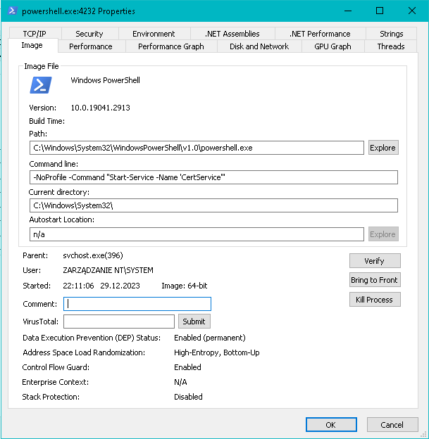
>    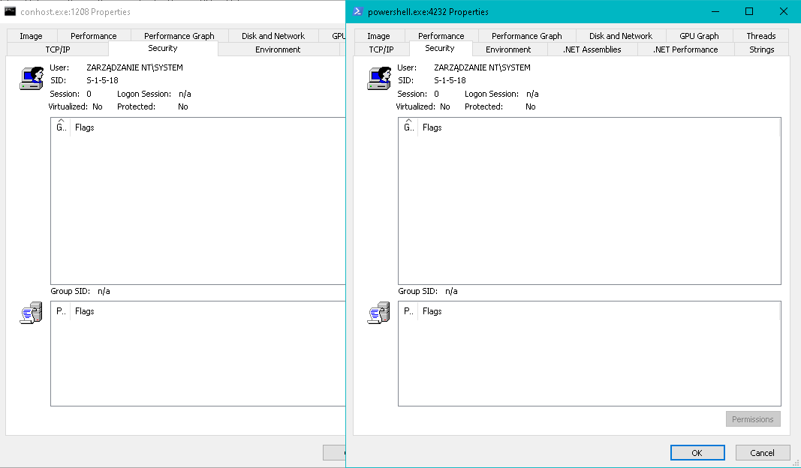
>    Powershell with administrator privilages running in normal case:
>    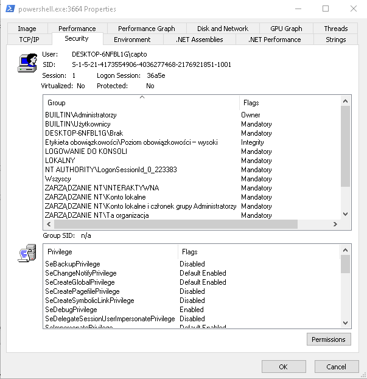
> 

## Function Descriptions

### PowerShellService

Launches the PowerShell process with a specified command, waits for the process to finish, terminates it, and reads the status. The return value is an error code or 0 for success.

### ServiceMain

The main function handles events related to controlling the service, such as START, STOP, PAUSE, CONTINUE.

# How to run

Create a service based on the svchost process.
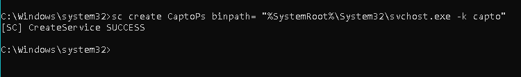  

The compiled DLL file size is  132 KB / 135 680 B.
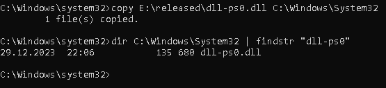  

Open the Registry Editor (regedit) and create a new key for your service. This key should be placed in the appropriate location.
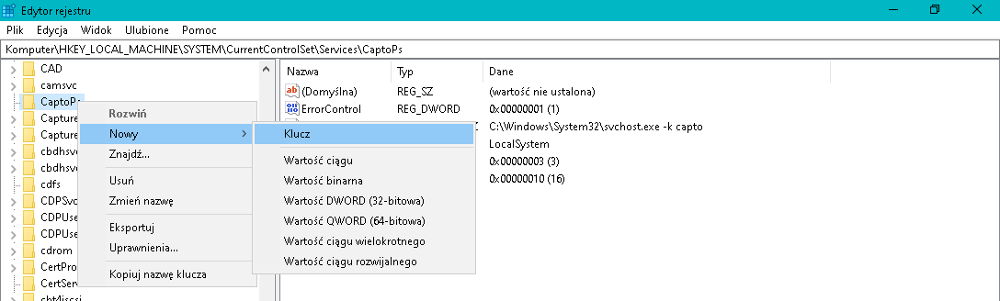  

Configure the path to the compiled DLL library of your service.
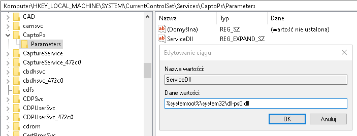  

Add a group name for svchost, where your service belongs.
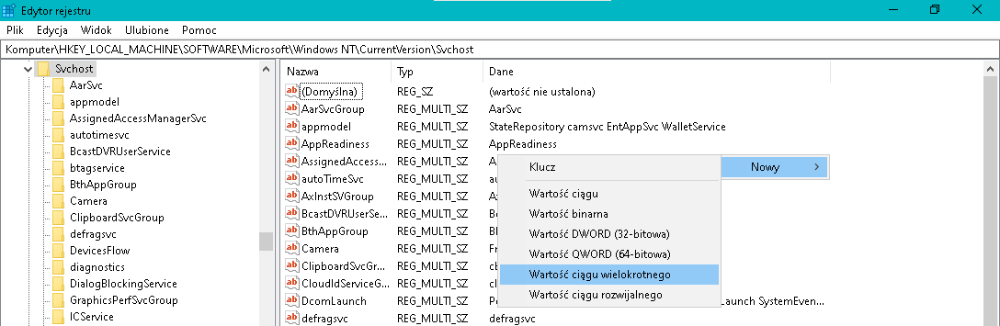  

Add the name of your service to the previously created svchost group.
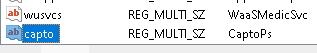  

Open DebugView as an administrator to trace information related to the DLL's operation.
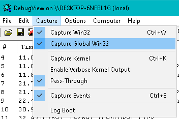  

Start the service.
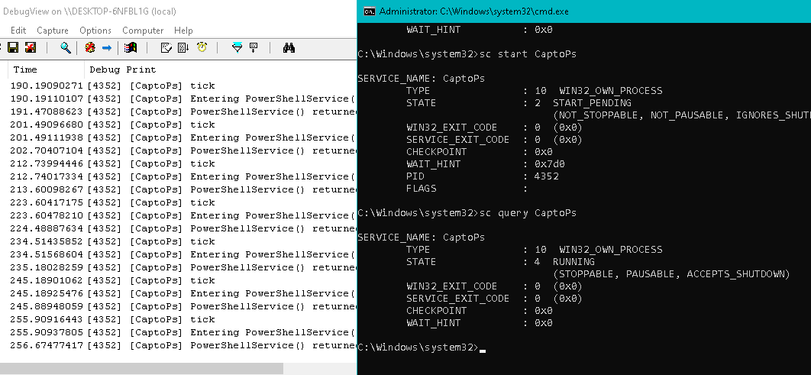  