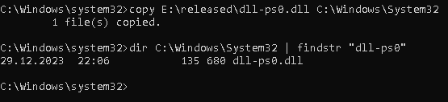
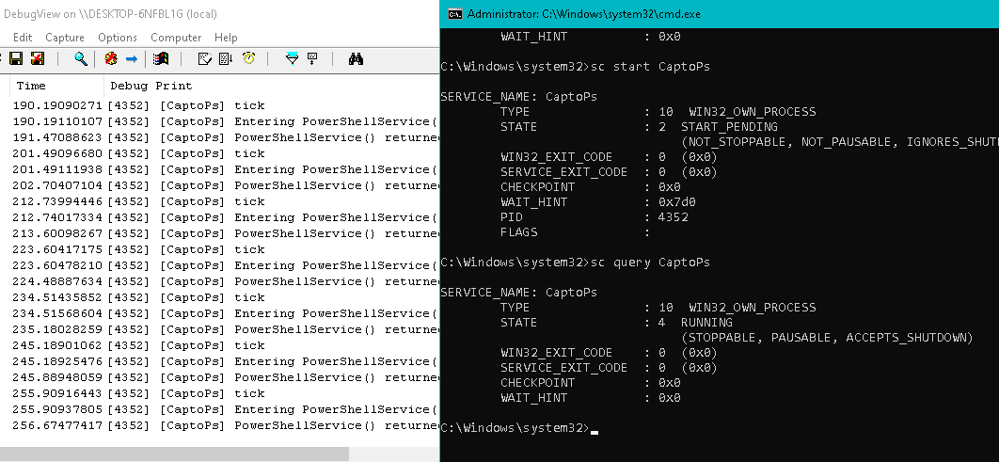

# Dokumentacja projektu psSession0

## Wprowadzenie

Z uwagi na problemy z konfiguracją Visual Studio, udostępniam gotowy do użycia projekt dla kompilacji DLL w języku C dla Windows.

## Opis

Biblioteka DLL wykonuje polecenie PowerShell w sesji 0. 
Uruchamia proces PowerShell z poleceniem uruchomienia usługi 'CertService'.
<a href="https://github.com/IsJackAlive/CaptoWindows/tree/main/certService">Link do usługi CertService</a>

Jest to zmodyfikowana wersja programu svc.c autorstwa Grzegorza Tworek. Kod svc.c jest dostępny na <a href="https://github.com/gtworek/PSBits/blob/master/Services/sekurak/svc.c">GitHub</a>.

> 

>  
Zrzuty ekranu
  
>    
>      
>    Powershell uruchomiony przez administratora w zwyczajny sposób:
>    
> 

## Opis Funkcji

### PowerShellService

Uruchamia proces PowerShell z określonym poleceniem, odczekuje na zakończenie procesu, zabija go i odczytuje status. Zwracaną wartością jest kod błędu lub 0 w przypadku sukcesu.

### ServiceMain

Funkcja główna obsługująca zdarzenia związane z kontrolą nad usługą, takie jak START, STOP, PAUSE, CONTINUE.

# Jak uruchomić

Utwórz usługę, która będzie oparta na procesie svchost.
  

Rozmiar pliku DLL(po kompilacji) wynosi 132 KB / 135 680 B.
  

Otwórz Edytor rejestru (regedit) i utwórz nowy klucz dla swojej usługi. Klucz ten powinien być umieszczony w odpowiedniej lokalizacji.
  

Skonfiguruj ścieżkę do skompilowanej biblioteki DLL Twojej usługi.
  

Dodaj nazwę grupy dla svchost, w której umieściłeś swoją usługę.
  

Dodaj nazwę swojej usługi do wcześniej utworzonej grupy svchost.
  

Otwórz DebugView jako administrator, aby śledzić informacje związane z działaniem DLL.
  

Uruchom usługę.
  