# Konfiguracja środowiska VisualStudio

## Kompilowanie aplikacji (.exe)

> 

>  
Tworzenie nowego projektu

>    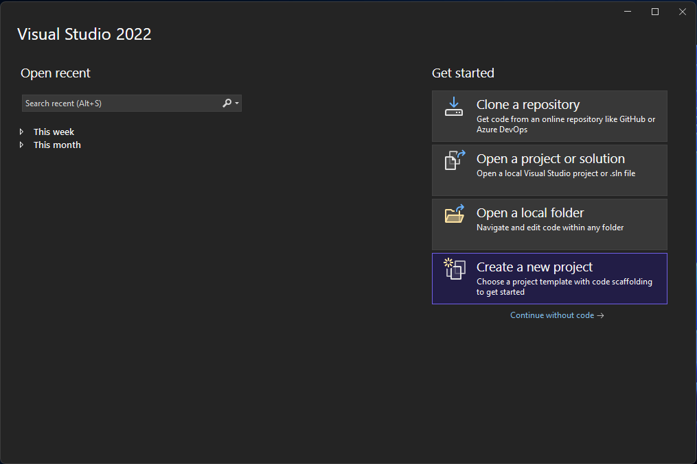  
>    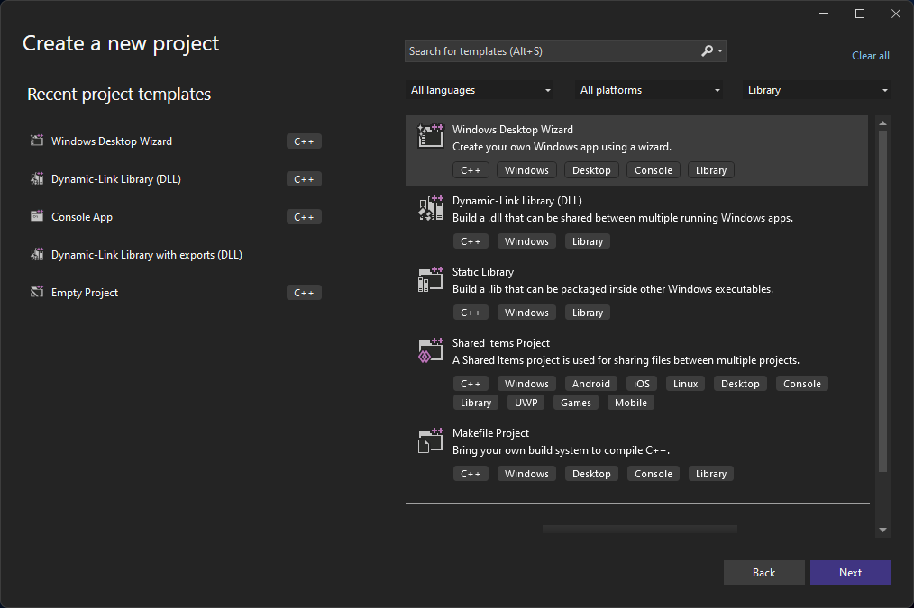  
>    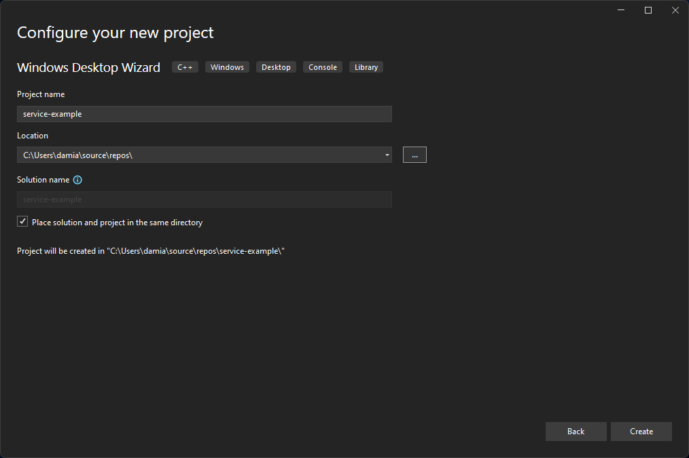  
>    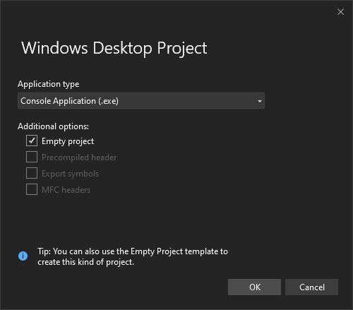  
>    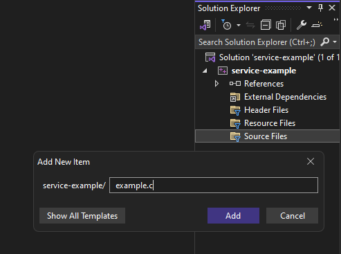  
>     <projectname> Properties" src=".scs/6.png" height=400px>  
>    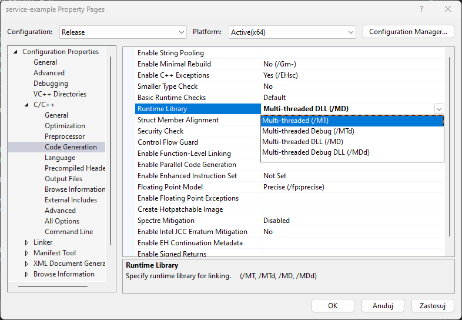  
>    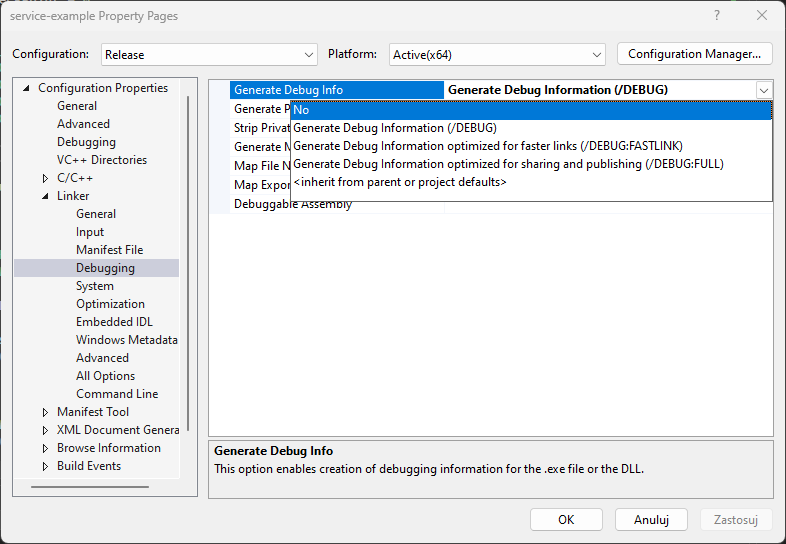  
>    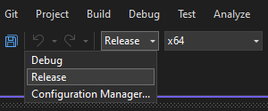  
>    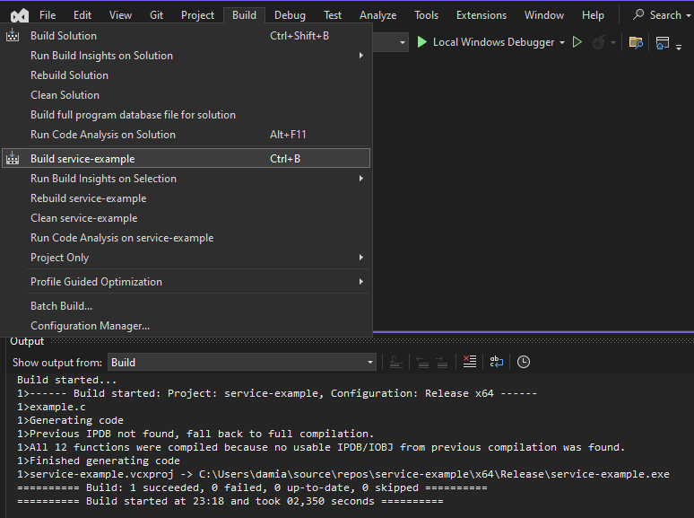  
> 

## Kompilowanie biblioteki (.dll)

> 

>  
Tworzenie nowego projektu

>      
>    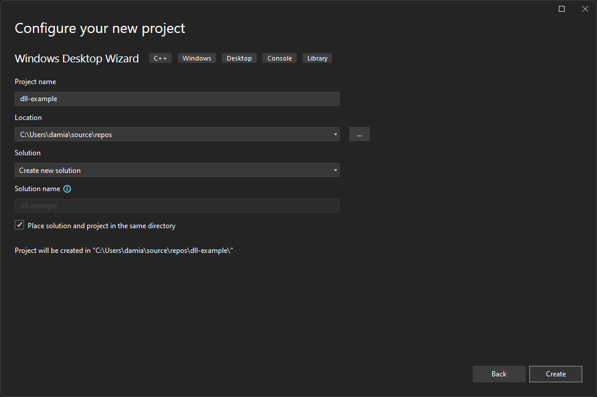  
>    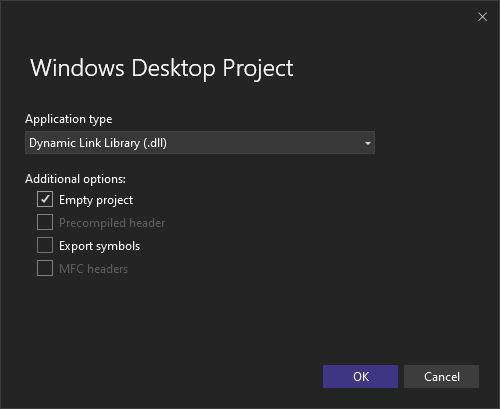  
>    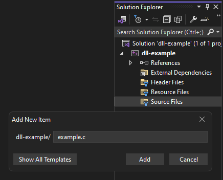  
>     Properties" src=".scs/14.png" height=400px>  
>    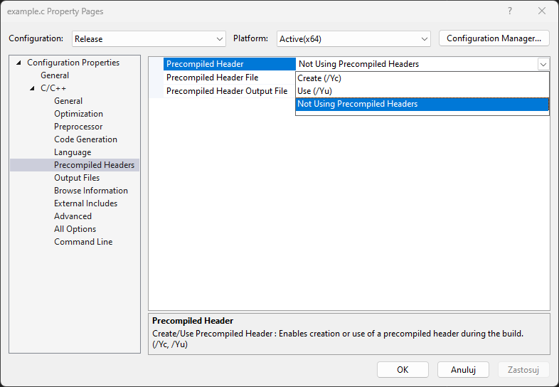  
>      
>      
>    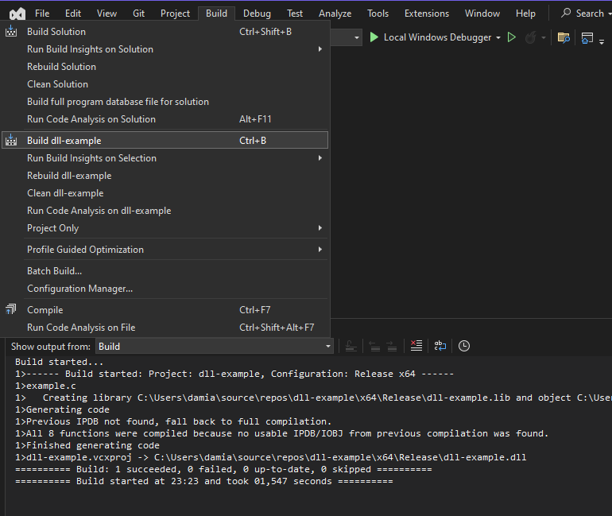  
> 

